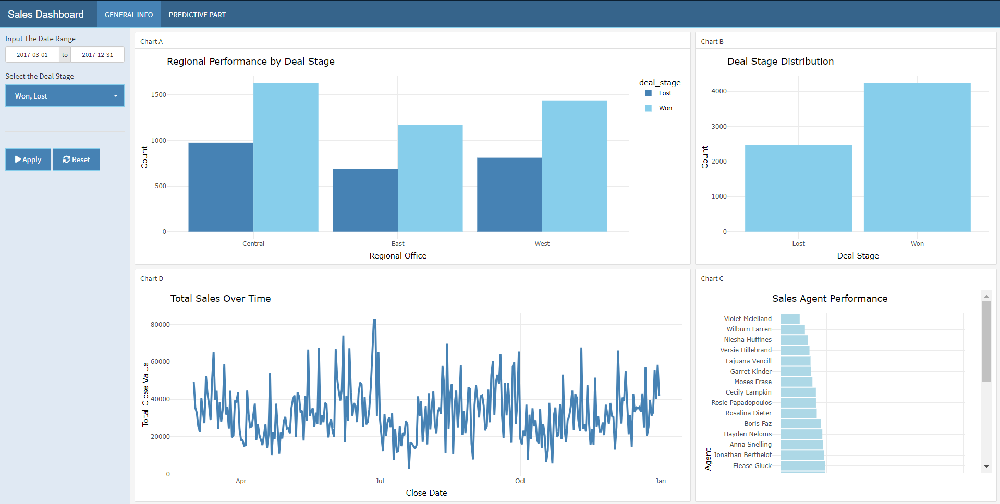
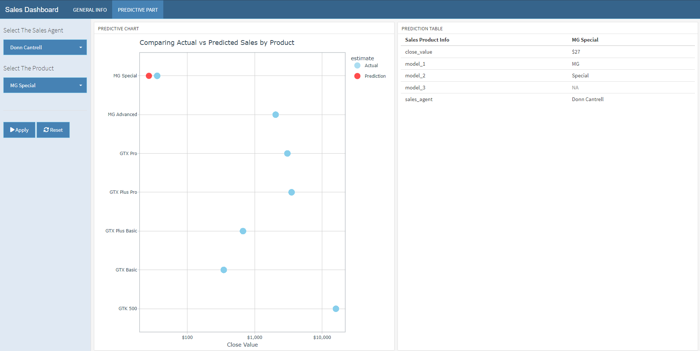

# 📊 Sales Dashboard & Predictive App

This interactive **R Shiny + Flexdashboard** application offers visual insights into company sales data and leverages **machine learning (XGBoost)** to predict deal revenue by product and agent. It focuses on products such as **GTX Basic**, **GTX Pro**, **MG Special**, **MG Advanced**, **GTX Plus Pro**, **GTX Plus Basic**, and **GTK 500**.

---

## 🔍 General Info (Interactive Dashboard)

This section presents a real-time, reactive breakdown of sales data:

- 📍 **Regional Deal Outcomes**: A map or chart showing the number and value of **Won** vs. **Lost** deals across regional offices.
- 📈 **Total Sales Over Time**: Line plot showing cumulative or interval-based `close_value` trends.
- 📊 **Deal Stage Distribution**: Pie or bar chart displaying deal stage outcomes.
- 👥 **Sales Agent Performance**: A vertical bar chart showing the total `close_value` each sales agent has generated.

> All plots are **reactive**, updating based on user-selected filters for date range and deal stage (e.g., Won/Lost).

### Example Visuals:




---

## 🤖 Predictive Component (Sales Value Estimation)

This part of the dashboard uses a **trained XGBoost model** to predict the expected `close_value` (deal value) for a given product and sales agent.

### 🔄 How It Works:

1. The user selects a **Sales Agent** and **Product**.
2. A reactive table and plot are generated showing the **predicted deal value** using engineered product components (`model_1`, `model_2`, etc.).
3. The prediction is visualized alongside historical deals for context.

### Example Output:



---

## 🛠️ Technologies Used

- **Frontend/UI**: R, Shiny, Flexdashboard
- **Visualizations**: plotly, ggplot2
- **ML Modeling**: XGBoost (via parsnip), rsample
- **Tidyverse stack**: dplyr, tidyr, readr, stringr

---

## 📁 Folder Structure

```
.
├── 00_dataset/
│   ├── sales_pipeline.csv
│   ├── sales_teams.csv
│   └── products.csv
├── 00_models/
│   └── model_xgboost.rds
├── 00_scripts/
│   ├── 01_separate_product.R
│   └── plot_functions.R
├── images/
│   ├── image1.png
│   └── image2.png
├── www/
│   └── styles-sheet.css
├── app.R
├── README.md
```

